# 🏗️ Booking System — Full Architecture Design
## Autopilot + Copilot Hybrid with Recommendation Engine, Budget, Rewards & Replanning

---

## 📑 Table of Contents

1. [Top-Level System Architecture](#1-top-level-system-architecture)
2. [Meeting Planner Flow](#2-meeting-planner-flow)
3. [Booking Flow — End to End](#3-booking-flow--end-to-end)
4. [Recommendation Engine Architecture](#4-recommendation-engine-architecture)
5. [Autopilot Decision Engine (Budget + Preferences)](#5-autopilot-decision-engine-budget--preferences)
6. [Rewards & Redemption Flow](#6-rewards--redemption-flow)
7. [Copilot Override & Autopilot Recalculation Loop](#7-copilot-override--autopilot-recalculation-loop)
8. [Data Model Overview](#8-data-model-overview)
9. [Component Interaction Summary](#9-component-interaction-summary)

---

## 1. Top-Level System Architecture

> High-level view of all major subsystems and how they connect.

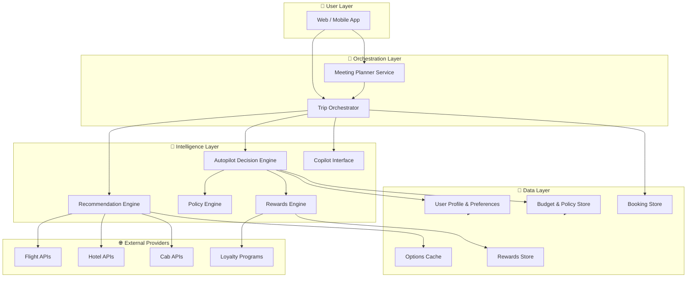

---

## 2. Meeting Planner Flow

> How a calendar meeting triggers trip planning, resolves attendees, and initiates booking.

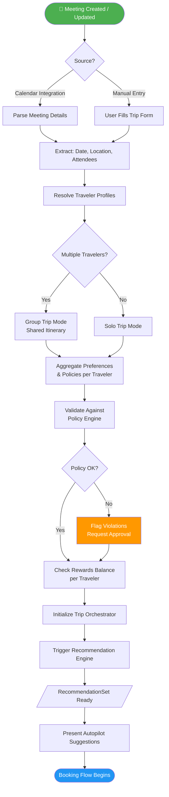

---

## 3. Booking Flow — End to End

> Step-by-step booking with Autopilot default and per-step Copilot override capability.

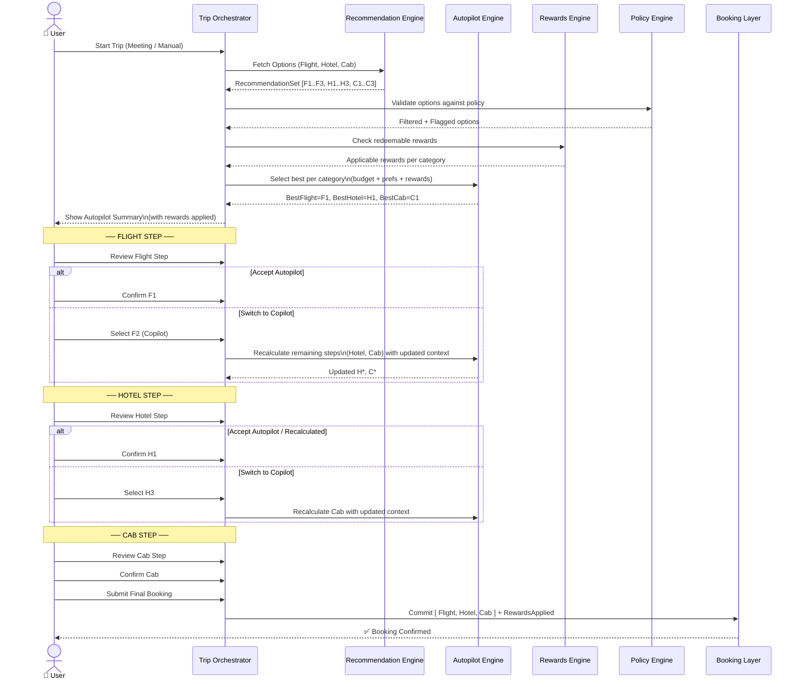

---

## 4. Recommendation Engine Architecture

> Internal design of the Recommendation Engine: how it fetches, filters, scores, and returns options.

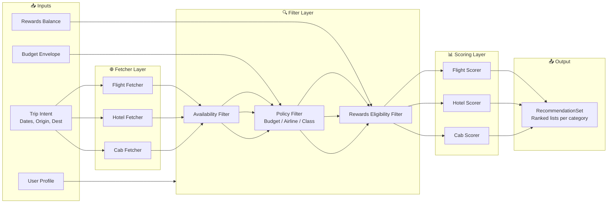

### Scoring Dimensions

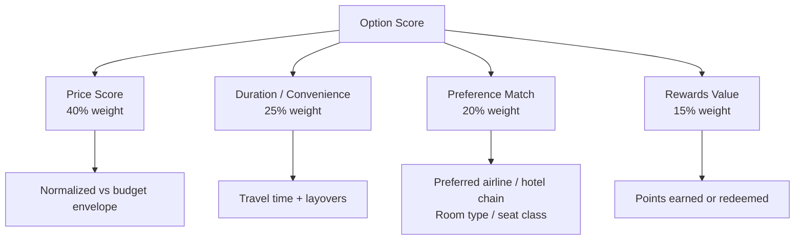

---

## 5. Autopilot Decision Engine (Budget + Preferences)

> How Autopilot selects the single best option per category using budget rules and user preferences.

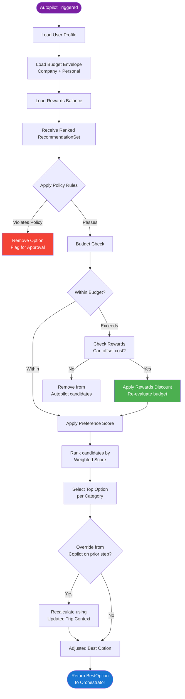

### Budget Envelope Model

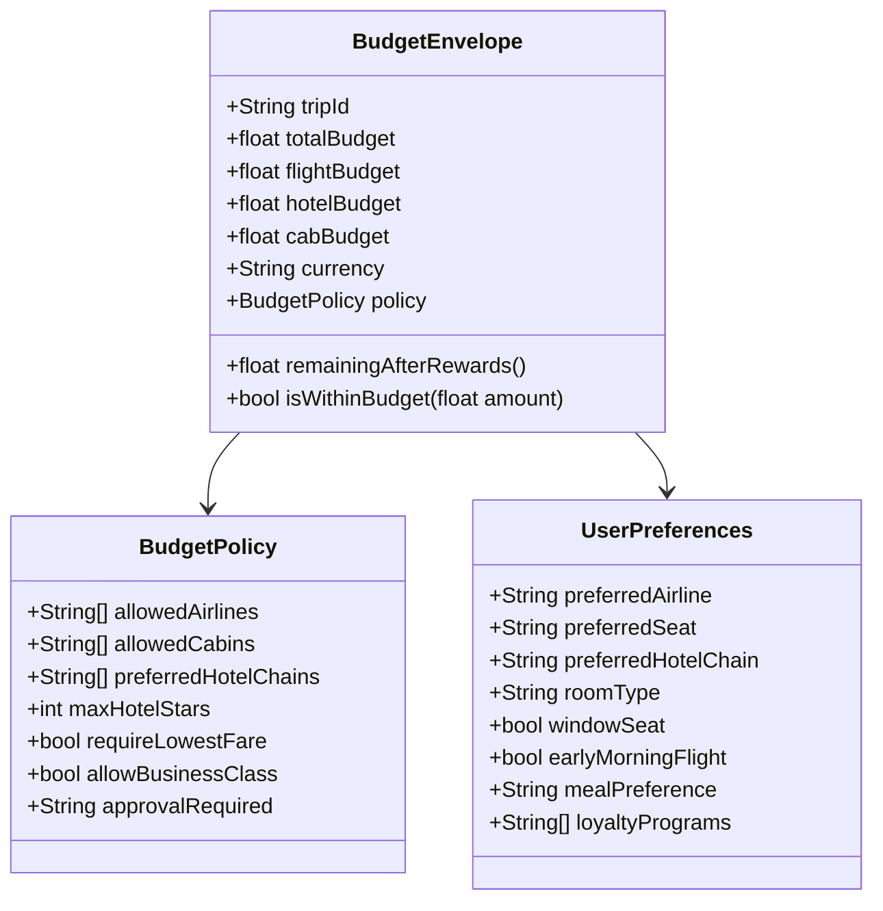

---

## 6. Rewards & Redemption Flow

> How rewards are checked, applied, and confirmed across the booking lifecycle.

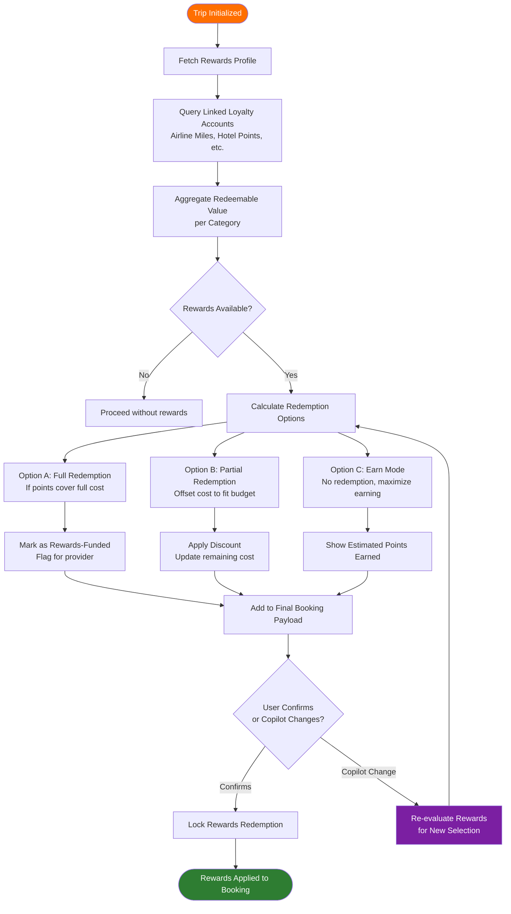

### Rewards Data Model

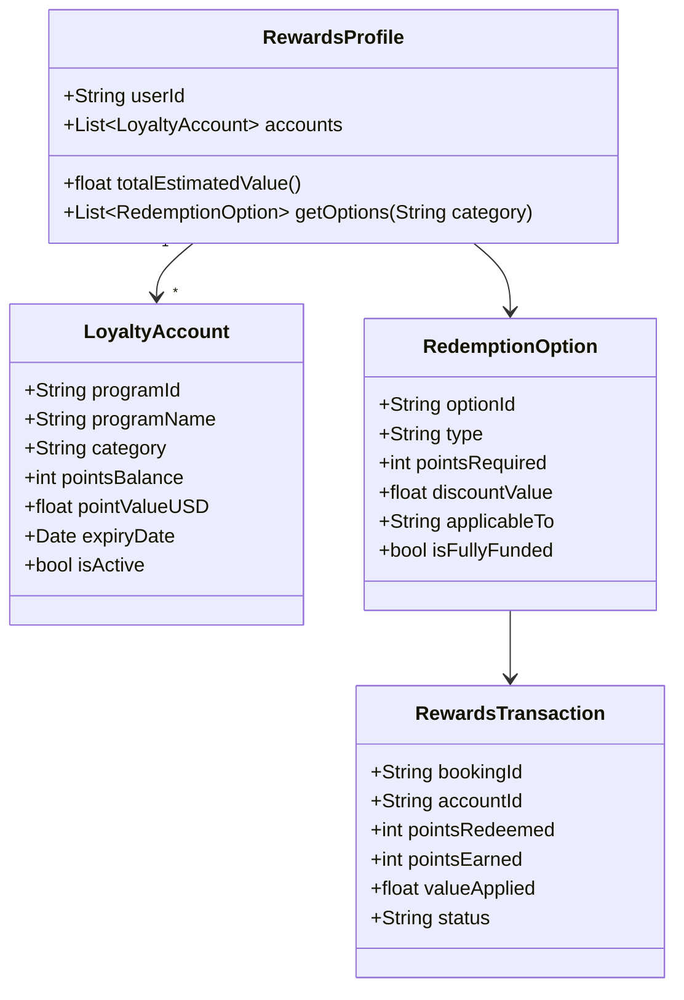

---

## 7. Copilot Override & Autopilot Recalculation Loop

> The core interaction loop — when user overrides, how the system responds and updates downstream steps.

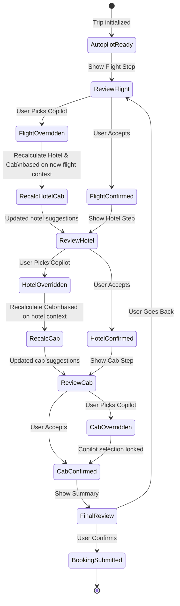

### Recalculation Logic

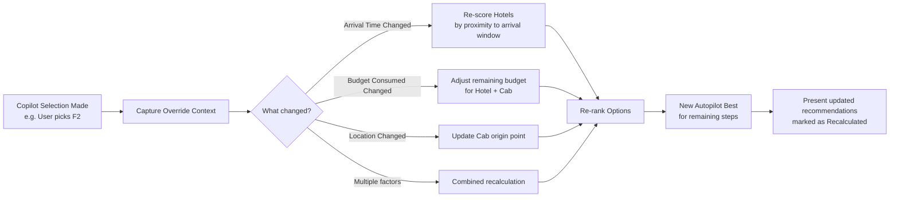

---

## 8. Data Model Overview

> Core entities and relationships across the full system.

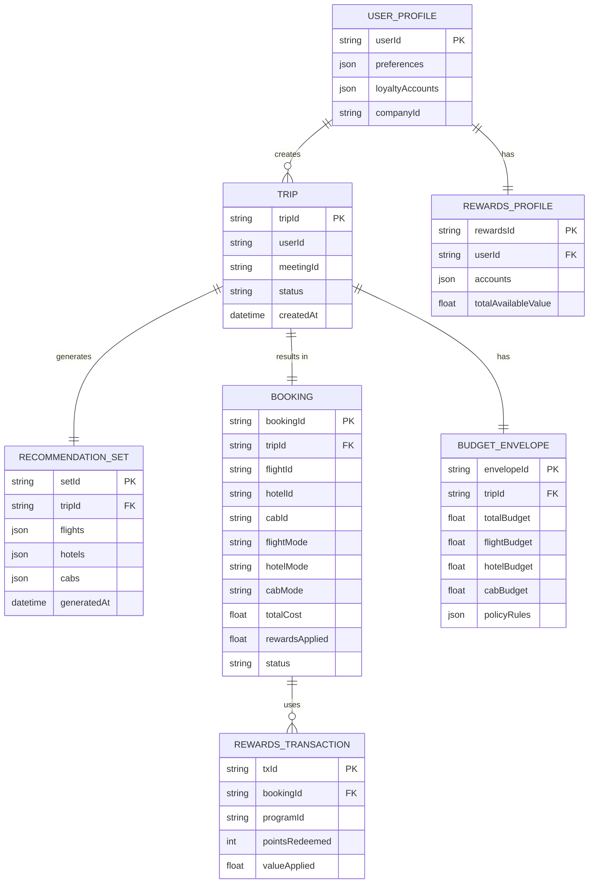

---

## 9. Component Interaction Summary

> Full system sequence showing all components talking to each other for a complete booking.

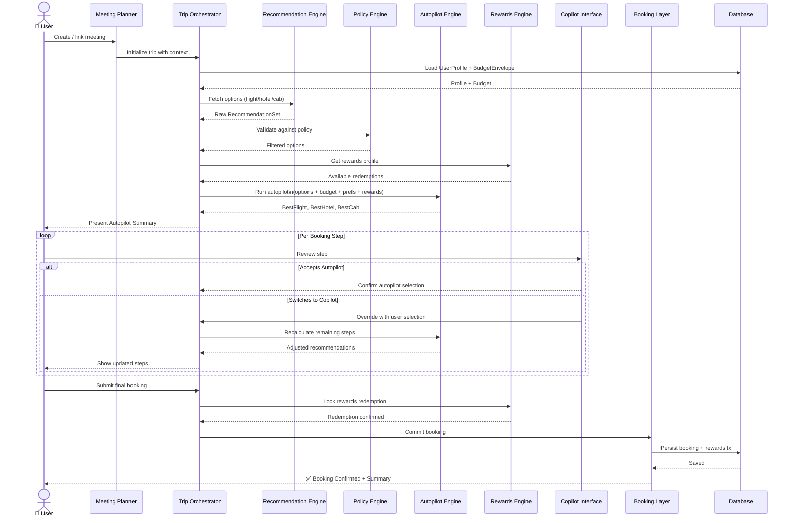

---

## 🧩 Design Decisions & Brainstorm Notes

### Recommendation Engine — Key Design Choices

| Concern | Decision | Rationale |
|---|---|---|
| Caching | Cache options by (trip_hash) for 15 min | Avoid redundant API calls |
| Staleness | Invalidate if budget/prefs change | Ensure accurate repricing |
| Recalculation scope | Only recalculate downstream steps | Don't invalidate confirmed steps |
| Scoring weights | Configurable per company policy | Enterprise customers differ |
| Rewards integration | Separate engine, feeds into scoring | Clean separation of concerns |

### Autopilot Recalculation Triggers

- ✅ User picks a different flight → recalculate hotel (proximity) + cab (route)
- ✅ User picks a different hotel → recalculate cab (pickup point)
- ✅ Budget consumed changes → re-rank remaining options by affordability
- ❌ User picks same-tier option → no recalculation needed (skip for performance)

### Rewards Modes

| Mode | When to apply | User action needed |
|---|---|---|
| Auto-Redeem | Points cover delta to fit budget | None (Autopilot applies) |
| Suggest Redeem | Points can unlock better option | User confirms |
| Earn Mode | No redemption, rack up points | User selects |
| Mixed | Partial redemption | User adjusts slider |

### Future Enhancements (Roadmap)

- **Cross-step context awareness** — flight arrival time influences hotel check-in suggestions
- **Group booking mode** — split-cost with shared itinerary
- **Real-time repricing** — live price refresh during copilot session
- **AI personalization layer** — learn from past trips to improve autopilot accuracy
- **Carbon footprint score** — add sustainability dimension to scoring

---

*Architecture Version: 1.0 | Last Updated: 2026*