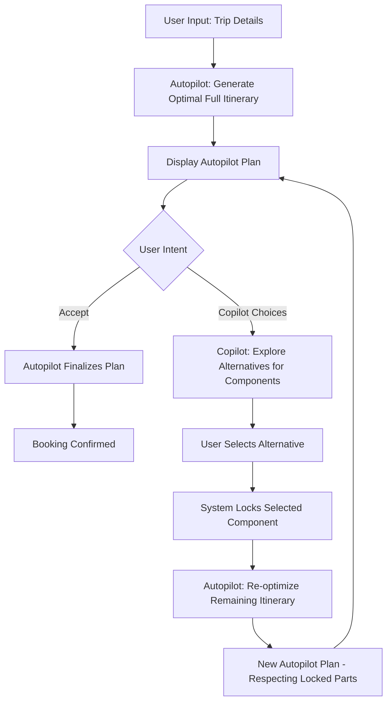

# Booking Flow.
## Overview.

```mermaid
flowchart TD
    A[User Input: Trip Details] --> B[Autopilot: Generate Optimal Full Itinerary]

    B --> C[Display Autopilot Plan]

    C --> D{User Intent}

    %% Accept autopilot
    D -->|Accept| E[Autopilot Finalizes Plan]
    E --> F[Booking Confirmed]

    %% Copilot exploration
    D -->|Copilot Choices| G[Copilot: Explore Alternatives for Components]

    G --> H[User Selects Alternative]
    H --> I[System Locks Selected Component]

    %% Back to autopilot
    I --> J[Autopilot: Re-optimize Remaining Itinerary]

    J --> K[New Autopilot Plan - Respecting Locked Parts]

    %% Loop continues
    K --> C
```

## Detialed Flow

```mermaid
flowchart TD
  START([User creates meeting]) --> INIT
  INIT[Init TripSession<br>Load budget <br> policy <br> preferences] --> REC1

  REC1[[Recommendation Engine<br>flight <br> hotel <br> cab]] --> SHOW
  SHOW[Show full RecommendationSet<br>autopilot pick highlighted per step] --> STEP_FLIGHT

  subgraph STEP_FLIGHT [Step 1 — Flight]
    direction TB
    F_Q{Accept autopilot pick?}
    F_Q -->|yes| F_AP[Lock — AUTOPILOT<br>Deduct from remainingBudget]
    F_Q -->|no| F_CP[Pick from copilot list]
    F_CP --> F_CPL[Lock — COPILOT<br> deduct from remaining <br>Budget]
  end

  F_AP --> REC2
  F_CPL --> REC2
  REC2[[Recommendation Engine<br>hotel <br> cab only <br> new remaining<br>Budget]] --> STEP_HOTEL

  subgraph STEP_HOTEL [Step 2 — Hotel]
    direction TB
    H_Q{Accept autopilot pick?}
    H_Q -->|yes| H_AP[Lock — AUTOPILOT<br>Deduct from remaining<br>Budget]
    H_Q -->|no| H_CP[Pick from copilot list]
    H_CP --> H_CPL[Lock — COPILOT<br>Deduct from remaining<br>Budget]
  end

  H_AP --> REC3
  H_CPL --> REC3
  REC3[[Recommendation Engine<br>cab only <br> new remainingBudget]] --> STEP_CAB

  subgraph STEP_CAB [Step 3 — Cab]
    direction TB
    C_Q{Accept autopilot pick?}
    C_Q -->|yes| C_AP[Lock — AUTOPILOT<br>Deduct from remainingBudget]
    C_Q -->|no| C_CP[Pick from copilot list]
    C_CP --> C_CPL[Lock — COPILOT<br>Deduct from remainingBudget]
  end

  C_AP --> SUMMARY
  C_CPL --> SUMMARY

  SUMMARY[Show booking summary<br>All 3 locked choices <br> total cost <br> rewards earned] --> OVR_Q

  OVR_Q{Any copilot choice exceeds policy?}
  OVR_Q -->|no| FINALIZE
  OVR_Q -->|yes| PAY[Payment screen<br>Company portion <br> redeem points <br> personal wallet]

  PAY --> PAY_Q{User confirms?}
  PAY_Q -->|yes| FINALIZE
  PAY_Q -->|no — change choices| SHOW

  FINALIZE[Finalize booking<br>Persist <br> grant rewards <br> return BookingResponse] --> END([Booking confirmed])
```