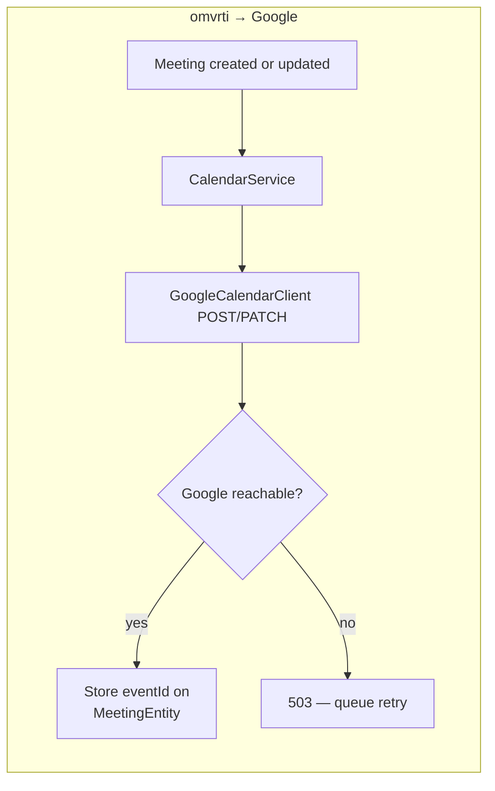
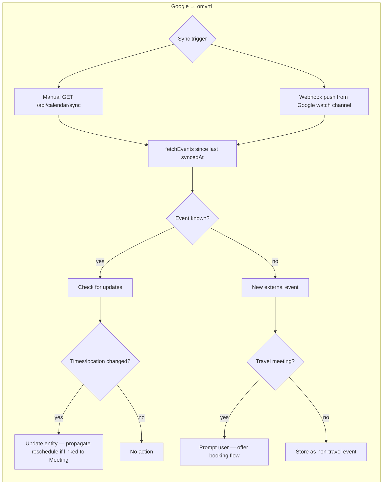
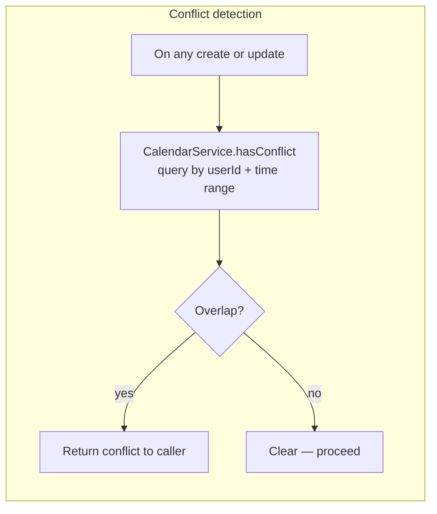

# Calender Integration and Flow

```mermaid
flowchart TD
  subgraph OUTBOUND [omvrti → Google]
  direction TB
    O1[Meeting created or updated] --> O2[CalendarService]
    O2 --> O3[GoogleCalendarClient POST/PATCH]
    O3 --> O5{Google reachable?}
    O5 -->|yes| O4[Store eventId on <br>MeetingEntity]
    O5 -->|no| O6[503 — queue retry]
  end
```

```mermaid
flowchart TD
  subgraph INBOUND [Google → omvrti  ]
  direction TB
    I1{Sync trigger} --> I2[Manual GET /api/calendar/sync]
    I1 --> I3[Webhook push from Google watch channel]
    I2 & I3 --> I4[fetchEvents since last syncedAt]
    I4 --> I5{Event known?}
    I5 -->|yes| I6[Check for updates] --> I7{Times/location changed?}
    I7 -->|yes| I8[Update entity — propagate reschedule if linked to Meeting]
    I7 -->|no| DONE[No action]
    I5 -->|no| I9[New external event] --> I10{Travel meeting?}
    I10 -->|yes| I11[Prompt user — offer booking flow]
    I10 -->|no| I12[Store as non-travel event]
  end

```

```mermaid
flowchart TD
  subgraph CONFLICT [Conflict detection ]
  direction TB
    CD1[On any create or update] --> CD2[CalendarService.hasConflict\nquery by userId + time range]
    CD2 --> CD3{Overlap?}
    CD3 -->|yes| CD4[Return conflict to caller]
    CD3 -->|no| CD5[Clear — proceed]
  end
```