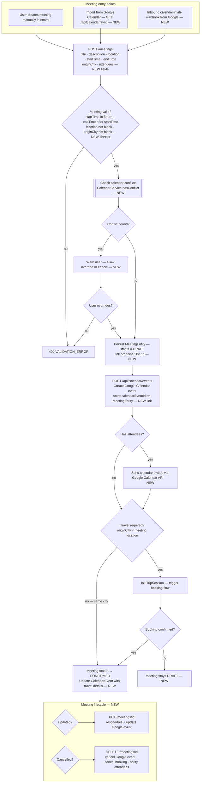

# Meeting planner flow 

```mermaid
flowchart TD
  subgraph ENTRY [Meeting entry points]
    direction LR
    E1[User creates meeting manually in omvrti]
    E2[Import from Google Calendar — GET /api/calendar/sync — NEW]
    E3[Inbound calendar invite webhook from Google — NEW]
  end

  E1 --> CREATE
  E2 --> CREATE
  E3 --> CREATE

  CREATE[POST /meetings<br>title · description · location · startTime · endTime<br>originCity · attendees — NEW fields] --> VALIDATE

  VALIDATE{Meeting valid?<br>startTime in future · endTime after startTime<br>location not blank · originCity not blank — NEW checks}
  VALIDATE -->|no| ERR1[400 VALIDATION_ERROR]
  VALIDATE -->|yes| CONFLICT

  CONFLICT[[Check calendar conflicts<br>CalendarService.hasConflict — NEW]] --> CONFLICT_Q

  CONFLICT_Q{Conflict found?}
  CONFLICT_Q -->|yes| WARN[Warn user — allow override or cancel — NEW]
  WARN --> OVERRIDE_Q{User overrides?}
  OVERRIDE_Q -->|no| ERR1
  OVERRIDE_Q -->|yes| PERSIST
  CONFLICT_Q -->|no| PERSIST

  PERSIST[Persist MeetingEntity — status = DRAFT<br>link organiserUserId — NEW] --> CAL_SYNC

  CAL_SYNC[POST /api/calendar/events<br>Create Google Calendar event<br>store calendarEventId on MeetingEntity — NEW link] --> ATTENDEES

  ATTENDEES{Has attendees?}
  ATTENDEES -->|yes| INVITE[Send calendar invites via Google Calendar API — NEW]
  ATTENDEES -->|no| TRIP_INIT
  INVITE --> TRIP_INIT

  TRIP_INIT{Travel required?<br>originCity ≠ meeting location}
  TRIP_INIT -->|no — same city| STATUS_CONFIRMED
  TRIP_INIT -->|yes| BOOKING_FLOW

  BOOKING_FLOW[Init TripSession — trigger booking flow] --> BOOKING_DONE

  BOOKING_DONE{Booking confirmed?}
  BOOKING_DONE -->|yes| STATUS_CONFIRMED
  BOOKING_DONE -->|no| STATUS_DRAFT[Meeting stays DRAFT — NEW]

  STATUS_CONFIRMED[Meeting status → CONFIRMED<br>Update CalendarEvent with travel details — NEW] --> LIFECYCLE

  subgraph LIFECYCLE [Meeting lifecycle — NEW]
    direction LR
    LC1{Updated?} --> LC2[PUT /meetings/id<br>reschedule + update Google event]
    LC3{Cancelled?} --> LC4[DELETE /meetings/id<br>cancel Google event · cancel booking · notify attendees]
  end

```