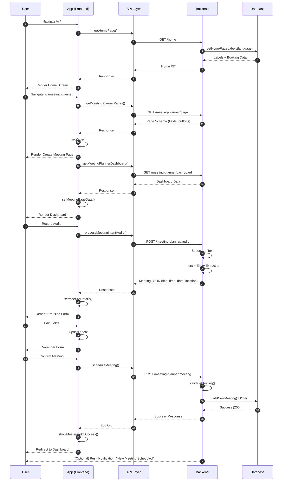

```mermaid
sequenceDiagram
    autonumber

    participant U as User
    participant A as App (Frontend)
    participant API as API Layer
    participant B as Backend
    participant DB as Database

    %% ---------------- HOME ----------------
    U->>A: Navigate to /
    A->>API: getHomePage()
    API->>B: GET /home
    B->>DB: getHomePageLabels(language)
    DB-->>B: Labels + Booking Data
    B-->>API: Home डेटा
    API-->>A: Response
    A-->>U: Render Home Screen

    %% ---------------- MEETING PLANNER PAGE ----------------
    U->>A: Navigate to /meeting-planner
    A->>API: getMeetingPlannerPages()
    API->>B: GET /meeting-planner/page
    B-->>API: Page Schema (fields, buttons)
    API-->>A: Response
    A->>A: setPage()
    A-->>U: Render Create Meeting Page

    %% ---------------- DASHBOARD ----------------
    A->>API: getMeetingPlannerDashboard()
    API->>B: GET /meeting-planner/dashboard
    B-->>API: Dashboard Data
    API-->>A: Response
    A->>A: setMeetingPageData()
    A-->>U: Render Dashboard

    %% ---------------- AUDIO INPUT ----------------
    U->>A: Record Audio
    A->>API: processMeetingIntentAudio()
    API->>B: POST /meeting-planner/audio

    B->>B: Speech-to-Text
    B->>B: Intent + Entity Extraction

    B-->>API: Meeting JSON (title, time, date, location)
    API-->>A: Response
    A->>A: setMeetingDetails()
    A-->>U: Render Pre-filled Form

    %% ---------------- MANUAL EDIT ----------------
    U->>A: Edit Fields
    A->>A: Update State
    A-->>U: Re-render Form

    %% ---------------- CONFIRM ----------------
    U->>A: Confirm Meeting
    A->>API: scheduleMeeting()
    API->>B: POST /meeting-planner/meeting

    B->>B: validateMeeting()
    B->>DB: addNewMeeting(JSON)
    DB-->>B: Success (200)

    B-->>API: Success Response
    API-->>A: 200 OK

    A->>A: showMeetingAddSuccess()
    A-->>U: Redirect to Dashboard

    %% ---------------- POST ACTION ----------------
    B-->>U: (Optional) Push Notification: "New Meeting Scheduled"
```