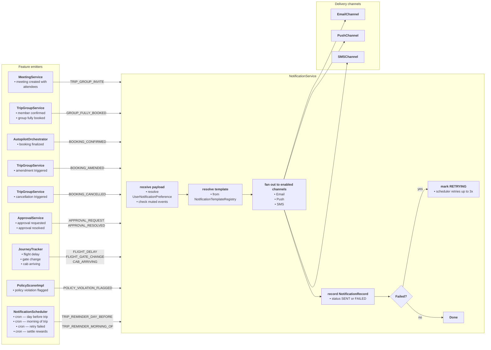

# Notification system

```mermaid
flowchart LR

  subgraph EMITTERS [Feature emitters]
    direction TB
    E1[<b>MeetingService</b><br>• meeting created with <br>attendees]
    E2[<b>TripGroupService</b><br>• member confirmed<br>• group fully booked]
    E3[<b>AutopilotOrchestrator</b><br>• booking finalized]
    E4[<b>TripGroupService</b><br>• amendment triggered]
    E5[<b>TripGroupService</b><br>• cancellation triggered]
    E6[<b>ApprovalService</b><br>• approval requested<br>• approval resolved]
    E7[<b>JourneyTracker</b><br>• flight delay<br>• gate change<br>• cab arriving]
    E8[<b>PolicyScorerImpl</b><br>• policy violation flagged]
    E9[<b>NotificationScheduler</b><br>• cron — day before trip<br>• cron — morning of trip<br>• cron — retry failed<br>• cron — settle rewards]
  end

  subgraph NS [NotificationService]
    direction TB
    NS1[<b>receive payload</b><br>• resolve<br> UserNotificationPreference<br>• check muted events] --> NS2
    NS2[<b>resolve template</b><br>• from <br>NotificationTemplateRegistry] --> NS3
    NS3[<b>fan out to enabled channels</b><br>• Email<br>• Push<br>• SMS] --> NS4
    NS4[<b>record NotificationRecord</b><br>• status SENT or FAILED] --> NS5
    NS5{<b>Failed?</b>}
    NS5 -->|yes| NS6[<b>mark RETRYING</b><br>• scheduler retries up to 3x]
    NS5 -->|no| NS7[<b>Done</b>]
  end

  subgraph CHANNELS [Delivery channels]
    direction TB
    C1[<b>EmailChannel</b>]
    C2[<b>PushChannel</b>]
    C3[<b>SMSChannel</b>]
  end

  E1 -->|TRIP_GROUP_INVITE| NS
  E2 -->|GROUP_FULLY_BOOKED| NS
  E3 -->|BOOKING_CONFIRMED| NS
  E4 -->|BOOKING_AMENDED| NS
  E5 -->|BOOKING_CANCELLED| NS
  E6 -->|APPROVAL_REQUEST <br> APPROVAL_RESOLVED| NS
  E7 -->|FLIGHT_DELAY <br> FLIGHT_GATE_CHANGE <br> CAB_ARRIVING| NS
  E8 -->|POLICY_VIOLATION_FLAGGED| NS
  E9 -->|TRIP_REMINDER_DAY_BEFORE <br> TRIP_REMINDER_MORNING_OF| NS

  NS3 --> C1
  NS3 --> C2
  NS3 --> C3

```