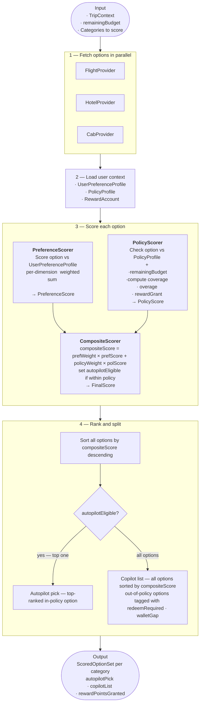

# Recommendation Engine


# 🚀 Recommendation Engine — System Design & Flow

## 🧭 Overview

The **Recommendation Engine** evaluates and ranks travel options (Flights, Hotels, Cabs) using:

* User preferences
* Corporate policy constraints
* Available budget
* Reward optimization


## ⚙️ Step 1 — Fetch Options (Parallelized)

* Providers queried in parallel
* Results normalized into common structure
* Add timeouts and fallback providers

---

## 👤 Step 2 — Load User Context

```
UserPreferenceProfile
PolicyProfile
RewardAccount
```
---

## 🧮 Step 3 — Scoring Engine

### Preference Score

```
PreferenceScore = Σ (w_i × s_i)
```

### Policy Score

```
PolicyScore = f(compliance, coverage, overage, rewards)
```

### Composite Score

```
FinalScore = w_p × PreferenceScore + w_c × PolicyScore
```

### Eligibility

```
autopilotEligible = within policy constraints
```

---

## 📊 Step 4 — Ranking & Decisioning

### Ranking

```
Sort all options by FinalScore (descending)
```

### Autopilot

```
Pick top option where autopilotEligible = true
```

### Copilot

```
All options sorted by FinalScore
```

Tags:

* redeemRequired
* walletGap

---

## 📤 Output Contract

```json
{
  "category": "Flights | Hotels | Cabs",
  "autopilotPick": {},
  "copilotList": [],
  "rewardPointsGranted": 0
}
```
---

## 💡 Design Suggestions

### Pluggable Scorers

```
score(option, context) → number
```

### Dynamic Weights

* Adjust based on user type
* Adjust based on trip type

### Caching

* Provider results (short TTL)
* User profile (medium TTL)
* Scored results (session)

### Observability

* Track score breakdown
* Monitor autopilot vs copilot

### Failure Handling

* Partial results on provider failure
* Skip failed scorers

---

## 🎯 Summary

The system separates:

* Fetching
* Context loading
* Scoring
* Decisioning

This makes it scalable, extensible, and explainable.
