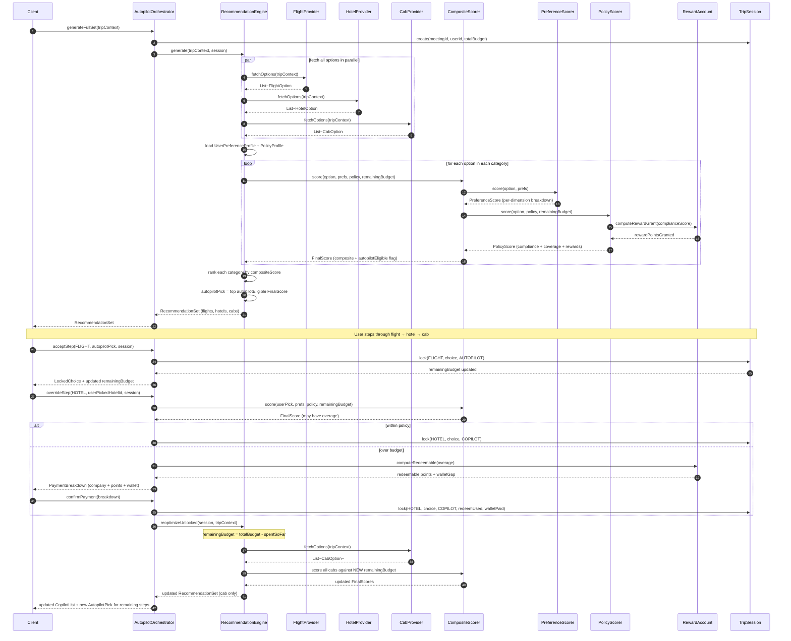

```mermaid

sequenceDiagram
  autonumber
  participant C as Client
  participant AO as AutopilotOrchestrator
  participant RE as RecommendationEngine
  participant FP as FlightProvider
  participant HP as HotelProvider
  participant CP as CabProvider
  participant CS as CompositeScorer
  participant PrefS as PreferenceScorer
  participant PolS as PolicyScorer
  participant RA as RewardAccount
  participant TS as TripSession

  C->>AO: generateFullSet(tripContext)
  AO->>TS: create(meetingId, userId, totalBudget)
  AO->>RE: generate(tripContext, session)

  par fetch all options in parallel
    RE->>FP: fetchOptions(tripContext)
    FP-->>RE: List~FlightOption
    RE->>HP: fetchOptions(tripContext)
    HP-->>RE: List~HotelOption
    RE->>CP: fetchOptions(tripContext)
    CP-->>RE: List~CabOption
  end

  RE->>RE: load UserPreferenceProfile + PolicyProfile

  loop for each option in each category
    RE->>CS: score(option, prefs, policy, remainingBudget)
    CS->>PrefS: score(option, prefs)
    PrefS-->>CS: PreferenceScore (per-dimension breakdown)
    CS->>PolS: score(option, policy, remainingBudget)
    PolS->>RA: computeRewardGrant(complianceScore)
    RA-->>PolS: rewardPointsGranted
    PolS-->>CS: PolicyScore (compliance + coverage + rewards)
    CS-->>RE: FinalScore (composite + autopilotEligible flag)
  end

  RE->>RE: rank each category by compositeScore
  RE->>RE: autopilotPick = top autopilotEligible FinalScore
  RE-->>AO: RecommendationSet (flights, hotels, cabs)
  AO-->>C: RecommendationSet

  Note over C,TS: User steps through flight → hotel → cab

  C->>AO: acceptStep(FLIGHT, autopilotPick, session)
  AO->>TS: lock(FLIGHT, choice, AUTOPILOT)
  TS-->>AO: remainingBudget updated
  AO-->>C: LockedChoice + updated remainingBudget

  C->>AO: overrideStep(HOTEL, userPickedHotelId, session)
  AO->>CS: score(userPick, prefs, policy, remainingBudget)
  CS-->>AO: FinalScore (may have overage)

  alt within policy
    AO->>TS: lock(HOTEL, choice, COPILOT)
  else over budget
    AO->>RA: computeRedeemable(overage)
    RA-->>AO: redeemable points + walletGap
    AO-->>C: PaymentBreakdown (company + points + wallet)
    C->>AO: confirmPayment(breakdown)
    AO->>TS: lock(HOTEL, choice, COPILOT, redeemUsed, walletPaid)
  end

  AO->>RE: reoptimizeUnlocked(session, tripContext)
  Note over RE: remainingBudget = totalBudget - spentSoFar
  RE->>CP: fetchOptions(tripContext)
  CP-->>RE: List~CabOption~
  RE->>CS: score all cabs against NEW remainingBudget
  CS-->>RE: updated FinalScores
  RE-->>AO: updated RecommendationSet (cab only)
  AO-->>C: updated CopilotList + new AutopilotPick for remaining steps
```