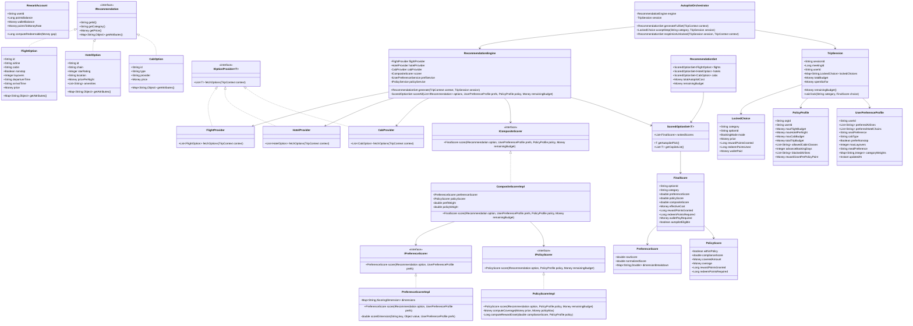

# Recommendation System LLD

```mermaid
classDiagram

  class UserPreferenceProfile {
    +String userId
    +List~String~ preferredAirlines
    +List~String~ preferredHotelChains
    +String seatPreference
    +String cabType
    +Boolean preferNonstop
    +Integer maxLayovers
    +String mealPreference
    +Map~String,Integer~ categoryWeights
    +Instant updatedAt
  }

  class PolicyProfile {
    +String orgId
    +String userId
    +Money maxFlightBudget
    +Money maxHotelPerNight
    +Money maxCabBudget
    +Money totalTripBudget
    +List~String~ allowedCabinClasses
    +Integer advanceBookingDays
    +List~String~ blockedAirlines
    +Money rewardGrantPerPolicyPoint
  }

  class RewardAccount {
    +String userId
    +Long pointsBalance
    +Money walletBalance
    +Money pointsToMoneyRate
    +Long computeRedeemable(Money gap)
  }

  class IRecommendation {
    <<interface>>
    +String getId()
    +String getCategory()
    +Money getPrice()
    +Map~String,Object~ getAttributes()
  }

  class FlightOption {
    +String id
    +String airline
    +String cabin
    +Boolean nonstop
    +Integer layovers
    +String departureTime
    +String arrivalTime
    +Money price
    +Map~String,Object~ getAttributes()
  }

  class HotelOption {
    +String id
    +String chain
    +Integer starRating
    +String location
    +Money pricePerNight
    +List~String~ amenities
    +Map~String,Object~ getAttributes()
  }

  class CabOption {
    +String id
    +String type
    +String provider
    +Money price
    +Map~String,Object~ getAttributes()
  }

  class PreferenceScore {
    +double rawScore
    +double normalizedScore
    +Map~String,Double~ dimensionBreakdown
  }

  class PolicyScore {
    +boolean withinPolicy
    +double complianceScore
    +Money coveredAmount
    +Money overage
    +Long rewardPointsGranted
    +Long redeemPointsRequired
  }

  class FinalScore {
    +String optionId
    +String category
    +double preferenceScore
    +double policyScore
    +double compositeScore
    +Money effectiveCost
    +Long rewardPointsGranted
    +Long redeemPointsRequired
    +Money walletPayRequired
    +boolean autopilotEligible
  }

  class IPreferenceScorer {
    <<interface>>
    +PreferenceScore score(IRecommendation option, UserPreferenceProfile prefs)
  }

  class IPolicyScorer {
    <<interface>>
    +PolicyScore score(IRecommendation option, PolicyProfile policy, Money remainingBudget)
  }

  class ICompositeScorer {
    <<interface>>
    +FinalScore score(IRecommendation option, UserPreferenceProfile prefs, PolicyProfile policy, Money remainingBudget)
  }

  class PreferenceScorerImpl {
    -Map~String,IScoringDimension~ dimensions
    +PreferenceScore score(IRecommendation option, UserPreferenceProfile prefs)
    -double scoreDimension(String key, Object value, UserPreferenceProfile prefs)
  }

  class PolicyScorerImpl {
    +PolicyScore score(IRecommendation option, PolicyProfile policy, Money remainingBudget)
    -Money computeCoverage(Money price, Money policyMax)
    -Long computeRewardGrant(double complianceScore, PolicyProfile policy)
  }

  class CompositeScorerImpl {
    -IPreferenceScorer preferenceScorer
    -IPolicyScorer policyScorer
    -double prefWeight
    -double policyWeight
    +FinalScore score(IRecommendation option, UserPreferenceProfile prefs, PolicyProfile policy, Money remainingBudget)
  }

  class IOptionProvider~T~ {
    <<interface>>
    +List~T~ fetchOptions(TripContext context)
  }

  class FlightProvider {
    +List~FlightOption~ fetchOptions(TripContext context)
  }

  class HotelProvider {
    +List~HotelOption~ fetchOptions(TripContext context)
  }

  class CabProvider {
    +List~CabOption~ fetchOptions(TripContext context)
  }

  class ScoredOptionSet~T~ {
    +List~FinalScore~ rankedScores
    +T getAutopilotPick()
    +List~T~ getCopilotList()
  }

  class RecommendationEngine {
    -FlightProvider flightProvider
    -HotelProvider hotelProvider
    -CabProvider cabProvider
    -ICompositeScorer scorer
    -IUserPreferenceService prefService
    -IPolicyService policyService
    +RecommendationSet generate(TripContext context, TripSession session)
    -ScoredOptionSet scoreAll(List~IRecommendation~ options, UserPreferenceProfile prefs, PolicyProfile policy, Money remainingBudget)
  }

  class RecommendationSet {
    +ScoredOptionSet~FlightOption~ flights
    +ScoredOptionSet~HotelOption~ hotels
    +ScoredOptionSet~CabOption~ cabs
    +Money totalAutopilotCost
    +Money remainingBudget
  }

  class TripSession {
    +String sessionId
    +Long meetingId
    +String userId
    +Map~String,LockedChoice~ lockedChoices
    +Money totalBudget
    +Money spentSoFar
    +Money remainingBudget()
    +void lock(String category, FinalScore choice)
  }

  class LockedChoice {
    +String category
    +String optionId
    +BookingMode mode
    +Money price
    +Long rewardPointsGranted
    +Long redeemPointsUsed
    +Money walletPaid
  }

  class AutopilotOrchestrator {
    -RecommendationEngine engine
    -TripSession session
    +RecommendationSet generateFullSet(TripContext context)
    +LockedChoice acceptStep(String category, TripSession session)
    +RecommendationSet reoptimizeUnlocked(TripSession session, TripContext context)
  }

  IRecommendation <|.. FlightOption
  IRecommendation <|.. HotelOption
  IRecommendation <|.. CabOption

  IPreferenceScorer <|.. PreferenceScorerImpl
  IPolicyScorer <|.. PolicyScorerImpl
  ICompositeScorer <|.. CompositeScorerImpl

  CompositeScorerImpl --> IPreferenceScorer
  CompositeScorerImpl --> IPolicyScorer

  IOptionProvider <|.. FlightProvider
  IOptionProvider <|.. HotelProvider
  IOptionProvider <|.. CabProvider

  RecommendationEngine --> FlightProvider
  RecommendationEngine --> HotelProvider
  RecommendationEngine --> CabProvider
  RecommendationEngine --> ICompositeScorer
  RecommendationEngine --> ScoredOptionSet

  ScoredOptionSet --> FinalScore

  FinalScore --> PreferenceScore
  FinalScore --> PolicyScore

  AutopilotOrchestrator --> RecommendationEngine
  AutopilotOrchestrator --> TripSession

  TripSession --> LockedChoice
  TripSession --> PolicyProfile
  TripSession --> UserPreferenceProfile

  RecommendationSet --> ScoredOptionSet
```