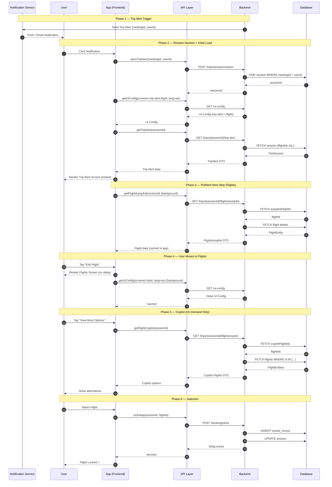

# SEQUENCE DIAGRAM

## Trip Alert Page



# Trip APIs and DTOs (Full Flow)

This document defines APIs and DTOs for the complete Trip Alert → Booking flow, including UI Config, Autopilot, Copilot, and progressive prefetching.

---

# 1. Session Resolve API

## API

```html
POST /api/v1/trips/{meetingId}/session
```

## Request

```json
{
  "userId": "user-123"
}
```

## Response

```json
{
  "data": {
    "sessionId": "sess-xyz",
    "meetingId": 42,
    "status": "ACTIVE"
  }
}
```

---

# 2. UI Config API (Multi-Screen)

## API

```html
GET /api/v1/ui-config?screens=trip-alert,flight,hotel&lang=en
```

## Response

```json
{
  "trip-alert":{
      "labels": {
        "title": "AutoPilot Trip Alert",
        "subTitle": "Trip Summary",
        "purpose": "Purpose",
        "budget": "Estimated Budget",
        "origin": "Origin",
        "destination": "Destination",
        "depart": "Depart",
        "return": "Return",
        "duration": "Trip Duration",
        "travelers": "Travelers"
      },
      "buttons": {
        "edit": "Edit Trip",
        "next": "View Flights"
      }
    
  },
  "flight":{
      "labels": {
        "title": "AutoPilot Booking",
        "subTitle": "Flight Details",
        "departStatus": "Departing flight",
        "returnStatus": "Returning flight",
        "fareClass": "Economy",
        "stopType": "Non stop",
        "durationLabel": "Duration",
        "tripType": "Round Trip",
        "rewardsLabel": "OmVrti.ai Rewards"
      },
      "buttons": {
        "edit": "Edit Flight",
        "next": "View Hotel"
      }
   
  },
  "hotel":{
      "labels": {
        "title": "AutoPilot Booking",
        "subTitle": "Hotel Details",
        "checkIn": "Check In",
        "checkOut": "Check Out",
        "parking": "Free Parking",
        "breakfast": "Buffet breakfast included",
        "rating": "Rated 4-Star",
        "distance": "10 mins walk to downtown",
        "priceLabel": "Per Night",
        "rewardsLabel": "OmVrti.ai Rewards"
      },
      "buttons": {
        "edit": "Edit Hotel",
        "next": "View Car Rental"
      }
  }
}
```

---

# 3. Trip Alert API (Autopilot Snapshot)

## API

```html
GET /api/v1/trips/{sessionId}/trip-alert
```

## Response

```json
{
  "sessionId": "sess-xyz",
  "flight-details": {
    "id": "F1",
    "outbound": {
      "date": "Mon, Jun 1, 2026",
      "departureTime": "8:30 AM",
      "arrivalTime": "4:55 PM",
      "originCode": "SFO",
      "destinationCode": "JFK",
      "airline": "United UA 435",
      "duration": "5h 25m"
    },
    "inbound": {
      "date": "Fri, Jun 5, 2026",
      "departureTime": "8:10 PM",
      "arrivalTime": "11:55 PM",
      "originCode": "JFK",
      "destinationCode": "SFO",
      "airline": "United UA 1558",
      "duration": "6h 45m"
    },
    "pricing": {
      "currency": "$",
      "total": 515,
      "rewardsValue": 10
    }
  }
}

```

---

# 4. Flight Autopilot API (Prefetched)

## API

```html
GET /api/v1/trips/{sessionId}/flights/autopilot
```

## Response

```json
{
  "data": {
    "flight": {
      "id": "F1",
      "score": 92,
      "reason": "Best price within policy",
      "segments": [],
      "pricing": {
        "total": 515,
        "currency": "$"
      }
    }
  }
}
```

---

# 5. Flight Copilot API (Lazy Loaded)

## API

```html
GET /api/v1/trips/{sessionId}/flights/copilot
```

## Response

```json
{
  "data": {
    "flights": [
      {
        "id": "F2",
        "score": 88,
        "tag": "Cheapest",
        "pricing": {
          "total": 480,
          "currency": "$"
        }
      }
    ],
    "pagination": {
      "page": 1,
      "limit": 5,
      "hasNext": true
    }
  }
}
```

---

# 6. Hotel Autopilot API (Prefetched)

## API

```html
GET /api/v1/trips/{sessionId}/hotels/autopilot
```

## Response

```json
{
  "data": {
    "hotel": {
      "id": "H1",
      "name": "Hilton Midtown",
      "rating": 4.5,
      "price": 200,
      "currency": "$"
    }
  }
}
```

---

# 7. Cab API

## API

```html
GET /api/v1/trips/{sessionId}/cabs
```

## Response

```json
{
  "data": {
    "autopilotCab": {
      "id": "C1",
      "type": "Sedan",
      "price": 800,
      "currency": "INR"
    },
    "copilotCabs": []
  }
}
```

---

# 8. Lock Selection API

## API

```html
POST /api/v1/bookings/lock
```

## Request

```json
{
  "sessionId": "sess-xyz",
  "category": "FLIGHT",
  "optionId": "F1"
}
```

## Response

```json
{
  "data": {
    "status": "LOCKED",
    "remainingBudget": 45500
  }
}
```

---

# 9. Finalize Booking API

## API

```html
POST /api/v1/trips/{sessionId}/finalize
```

## Request

```json
{
  "redeemPoints": 300,
  "walletPayAmount": 2700
}
```

## Response

```json
{
  "data": {
    "bookingId": "B1",
    "status": "CONFIRMED"
  }
}
```

---

# Summary

* Session-based flow
* UI Config separated
* Autopilot prefetched
* Copilot lazy loaded
* Progressive data loading
